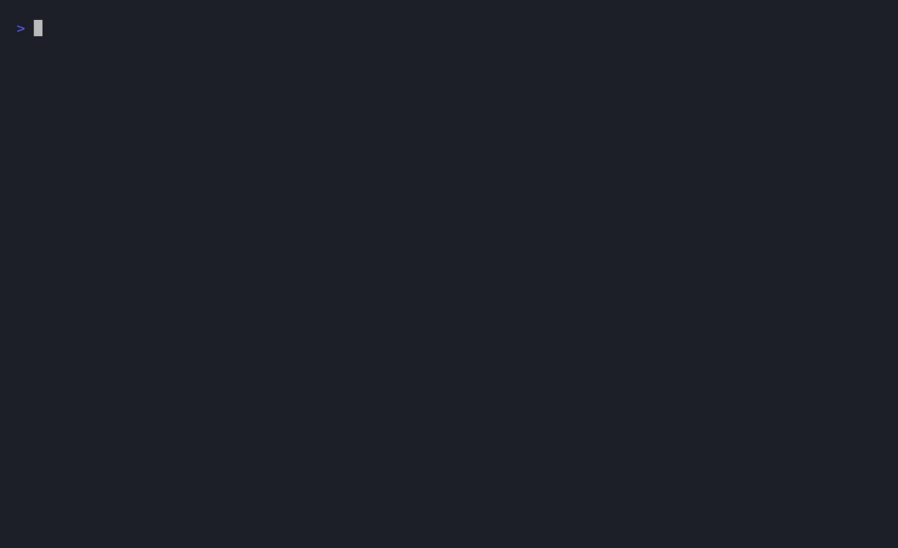

<div align="center">

# clipbeam

**Give your remote coding agent eyes and an inbox.** Beam a screenshot, file, or
message straight onto a headless box — over the SSH you already have, or
Tailscale. It lands a real file on the box's disk and **prints the absolute
path**, so your agent just reads it. No cloud, no account.

Built for coding agents: every command is `--json`-able and self-describing.

[](https://github.com/vybzai/clipbeam-cli/actions/workflows/ci.yml)
[](https://pkg.go.dev/github.com/vybzai/clipbeam-cli)
[](LICENSE)

</div>

---

## What it solves

You run a coding agent (Claude Code, OpenClaw, Hermes, aider, …) on a headless
Linux box — a Hostinger / Vultr / homelab VPS — and you SSH in to drive it. Then
you hit the wall: you have a screenshot or a file **on your laptop**, and you
**cannot paste it into that remote TUI**. The terminal reads your *local*
machine's clipboard, and there is no shared pasteboard across the SSH boundary.
The only thing a remote agent can actually ingest is a **real file on the box's
disk that it can read by absolute path**.

`clipbeam` closes that gap and gives the remote agent two capabilities it
otherwise can't have:

- **Eyes.** Beam a screenshot, an image, or any file from your laptop into the
  box you're already SSH'd into. `clipbeam` lands it on the box's disk and
  **prints the absolute path**, so your agent just reads it:

  ```sh
  # on the box, in your agent:
  claude "what's in $(clipbeam last)"
  ```

- **An inbox.** A private agent-to-agent channel — an in-memory FIFO inbox that
  **never touches the human's clipboard or notifications**. One agent beams a
  message or a file to it; the other drains it one item at a time (see
  [Built for agents](#built-for-agents)).

No cloud, no account, no open ports: `clipbeam` rides the SSH connection you
already have. It speaks the macOS ClipBeam.app's (source private) frozen
**Envelope v1** wire protocol byte-for-byte, so the `ClipBeam.app` and the
`clipbeam` CLI **interoperate** over Tailscale.

## Demo



> A tour of the agent-first surface (rendered from [`docs/demo.tape`](docs/demo.tape)
> with [vhs](https://github.com/charmbracelet/vhs)). The full story — drag an image
> on the laptop → `clipbeam send` → the box's agent reads `clipbeam last` — is a
> ~30-second flow once you've `clipbeam setup`'d a box.

## Install

```sh
# macOS / Linux — Homebrew
brew install vybzai/tap/clipbeam

# any Unix — one-line installer (OS/arch detect, checksum-verified)
curl -fsSL https://raw.githubusercontent.com/vybzai/clipbeam-cli/main/install.sh | sh

# Go toolchain
go install github.com/vybzai/clipbeam-cli/cmd/clipbeam@latest
```

The binary is a single static executable — no runtime, no dependencies. On Linux
it is a fully static ELF; on macOS it is **self-contained and links only the
always-present system dylibs** (`libSystem`, `libresolv`) — there is no such thing
as a 100%-static Mach-O, and `clipbeam` pulls in no third-party or cgo libraries.

## Quickstart

```sh
# 1. On the laptop, once per box — clipbeam bootstraps the remote binary over
#    your existing SSH (detects arch, streams the matching build, pairs):
clipbeam setup root@my-box

# 2. Forever after, from the laptop:
clipbeam send screenshot.png my-box     # → prints the REMOTE absolute path
clipbeam shot my-box                     # screenshot → box, prints the path

# 3. On the box, your agent just reads the path:
claude "describe the image at $(clipbeam last)"
```

No Tailscale required, no open ports, no config-file editing. `clipbeam` rides the
SSH connection you already have. If you *do* run Tailscale, point it at a `100.x`
peer instead — same wire, always-on.

## Built for agents

Every command emits a stable, versioned JSON object with `--json` (or set
`CLIPBEAM_JSON=1`), uses a documented deterministic exit-code table, and is
self-describing via `clipbeam schema` — so an AI agent can drive it with no human
and no guessing.

```sh
# agent A on the laptop → agent B on the box, on a private channel that never
# touches the human's clipboard or notifications:
clipbeam msg "build is green — log attached next"   # text → B's agent inbox
clipbeam send build.log my-box --agent              # file → B's agent inbox

# agent B drains its inbox (long-poll; one item per call, FIFO):
clipbeam recv --json
# {"schema":"clipbeam.v1","ok":true,"type":"file","sender":"…","path":"/…/build.log","text":null}

# or stream every incoming item as NDJSON for an event loop:
clipbeam watch --json
```

| Verb | What it does |
|---|---|
| `send <file> [target] [--agent]` | beam a file; prints the remote path |
| `shot [target] [--agent] [full\|window\|region]` | screenshot → beam the PNG |
| `msg <text…>` | text message → the peer's agent inbox |
| `push` | beam the current local clipboard |
| `last` / `wait` | print the last received path / block for the next one |
| `recv [--timeout N]` | dequeue one agent-inbox item (FIFO long-poll) |
| `watch [--channel …]` | stream received items as NDJSON |
| `setup <user@host>` | bootstrap + pair a remote box over SSH |
| `serve` | run the receiver daemon (unix-socket / tcp / tailscale) |
| `health` / `version` / `schema` | liveness / version / full self-description |
| `install-skill` | drop a maintained agent skill into `~/.claude`, `~/.codex`, … |
| `doctor` / `service` | diagnostics / optional service unit (off by default) |

Run `clipbeam schema` for the complete machine-readable surface (every command,
flag, JSON shape, and exit code), or `clipbeam install-skill` to teach the agents
on a box how to use it.

## Security model

`clipbeam` is push-only — nothing leaves a machine unless you act. Transport is
tiered (full detail in [SECURITY.md](SECURITY.md)):

- **SSH (default).** You are already SSH'd in; `clipbeam` rides that tunnel —
  encryption, authentication, and NAT traversal for free, with **no new account**.
  Host keys are verified against `known_hosts` (strict; `InsecureIgnoreHostKey` is
  banned and there is no `--insecure` flag); first-contact TOFU happens only under
  `clipbeam setup`, never silently under a data command.
- **Tailscale (preferred for always-on).** Plain HTTP inside the WireGuard tunnel,
  gated by exact-peer-IP **and** a constant-time 120-bit token.
- **Public + TLS** is designed but **deferred** — a bare public port is a footgun.

Secrets live in the macOS Keychain or a `0600` token file on Linux; logs redact
all `X-ClipBeam-*` headers and the token; saved filenames are sanitized and
traversal-proof.

## How it compares

| | image into a remote TUI? | encrypted | zero extra account | agent-native (`--json`, inbox) | wire-compatible w/ ClipBeam.app |
|---|---|---|---|---|---|
| **clipbeam** | ✅ disk + path | ✅ SSH / WireGuard | ✅ rides your SSH | ✅ | ✅ |
| `scp` / `rsync` | ⚠️ manual path juggling | ✅ | ✅ | ❌ | ❌ |
| Tailscale-only raw HTTP | ⚠️ no path/inbox ergonomics | ✅ | ❌ needs Tailscale | ❌ | partial |
| pastebins / gists | ❌ (and leaks to a third party) | ⚠️ in transit only | ❌ account | ❌ | ❌ |

## Interop

`clipbeam` is a from-scratch Go re-implementation of the **frozen Envelope v1**
protocol shipped by the macOS `ClipBeam.app` (source private). The wire is
validated by golden fixtures captured from the real Swift app
(`testdata/interop/`) and asserted in CI in both directions — so a Mac and a Linux
box interoperate over Tailscale out of the box. The protocol is described in
[PROTOCOL.md](PROTOCOL.md) (the Swift source + fixtures are authoritative).

## Building from source

```sh
git clone https://github.com/vybzai/clipbeam-cli
cd clipbeam-cli
CGO_ENABLED=0 go build ./cmd/clipbeam
go test -race ./...
```

Requires Go 1.26+. See [CONTRIBUTING.md](CONTRIBUTING.md).

## License

[MIT](LICENSE) © Sani / VYBZ.
